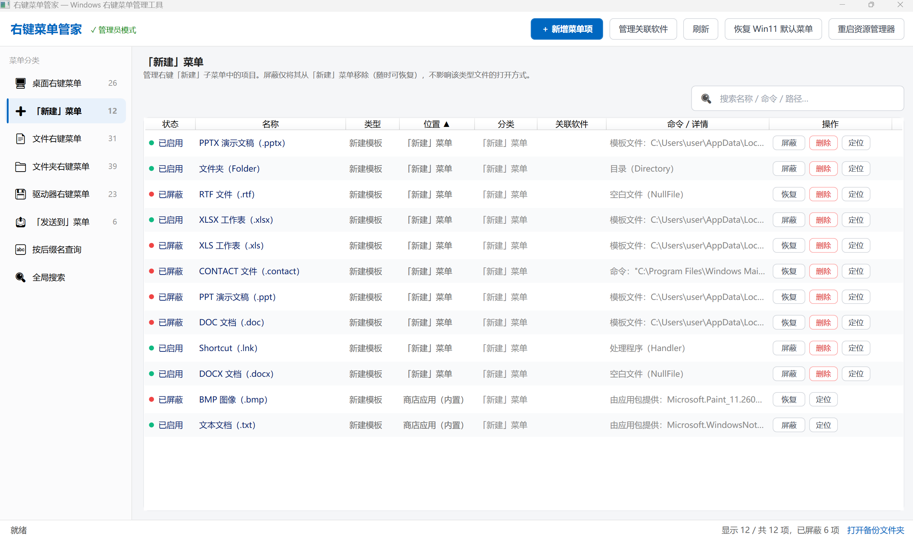

# 右键菜单管家（ContextMenuManager）

**Windows 10/11 右键菜单管理工具。** 用完就关，不驻留后台，直接改注册表里的原生菜单。

绿色单文件，免安装。主程序：`发布\右键菜单管家.exe`（约 70 KB）。



---

## 为什么做这个

右键菜单装的软件多了就会变得很乱。有些软件卸载后菜单项还在，有些软件一装就往右键塞七八个项，还有些你根本不知道是哪来的。

这工具能管理几乎所有类型的右键菜单，**包括那些很难碰到的地方**：

- **商店应用的「新建」菜单**：Win11 记事本、画图新增的「文本文档」「BMP 图像」这些项，藏在 MSIX 包清单里，传统工具看不到。这里能列出来，能屏蔽，能还原
- **按后缀名精确查询**：`.txt` 文件有哪些专属菜单？`.jpg` 呢？输入后缀名直接看，不用一个个文件试
- **深度扫描 Shell 扩展**：不光是静态菜单项，连 DLL 注册的 COM 处理程序（shellex）也能找出来、能屏蔽
- **全局搜索**：不确定某个菜单项在哪个分类？输关键字，跨所有分类搜，找到后直接定位

桌面、文件、文件夹、驱动器、新建、发送到，所有常见入口都覆盖了。屏蔽是可逆的，删除前会自动备份 `.reg` 文件，随时能还原。

---

## 能管理什么

| 分类 | 说明 |
|------|------|
| 🖥️ **桌面右键菜单** | 桌面空白处、文件夹窗口空白处的右键菜单 |
| ➕ **「新建」菜单** | 右键→新建 子菜单里的各种文件类型<br>含商店应用（MSIX）的内置项，比如 Win11 记事本的「文本文档」 |
| 📄 **文件右键菜单** | 右键任意文件时的通用菜单（不分文件类型） |
| 📁 **文件夹右键菜单** | 右键文件夹时的菜单 |
| 💾 **驱动器右键菜单** | 右键磁盘（C:、D: 等）时的菜单 |
| 📤 **「发送到」菜单** | 右键→发送到 子菜单里的项目 |
| 🔤 **按后缀名查询** | 输入 `.txt`、`.jpg` 等后缀，查询该类型文件的专属菜单<br>包括关联程序和「新建」模板 |
| 🔍 **全局搜索** | 跨所有分类搜索，支持名称、命令、路径、关联软件 |

每个分类都覆盖两类菜单：
- **静态菜单项（verb）**：注册表 `shell\` 下的项，比如「用记事本打开」
- **Shell 扩展（COM）**：`shellex\ContextMenuHandlers\` 下由 DLL 提供的动态菜单，比如压缩软件、网盘的菜单

---

## 能做什么

- **屏蔽/恢复**：全程可逆，不删数据，随时能还原
- **删除**：从注册表移除，删除前自动导出 `.reg` 备份文件，双击就能恢复
- **新增**：
  - 新增普通右键菜单项（支持指定程序、命令、图标、显示位置、Shift 显示、置顶）
  - 为指定后缀名新增「新建」模板
  - 新增「发送到」项（选目标程序或文件夹）
- **定位**：一键在注册表编辑器或资源管理器中定位该项
- **排序**：点列表标题按状态、名称、类型、位置、命令排序，标题显示 ▲▼
- **Win11 经典菜单**：一键在 Win11 精简菜单和经典完整菜单之间切换
- **重启资源管理器**：部分修改需要重启 explorer 才生效，提供一键重启

---

## 商店应用的「新建」菜单怎么管

Win11 有些「新建」项（记事本的「文本文档」、画图的「BMP 图像」）来自商店应用（MSIX）包清单，不在传统 `ShellNew` 注册表键里。

这工具能识别并列出这些项（位置显示「商店应用（内置）」），支持屏蔽和恢复：

- **屏蔽原理**：改写 `HKCU\...\Local Settings\MrtCache` 里缓存的显示名，追加超长内容，让这项从菜单消失
- **恢复**：去掉追加内容，还原原始显示名
- **不支持删除**：这类项属于系统应用的一部分，用屏蔽代替
- **生效时机**：通常要重启资源管理器才能在右键菜单看到效果

---

## 屏蔽的实现原理

| 类型 | 屏蔽方式 | 恢复方式 |
|------|----------|----------|
| 静态菜单项 | 写入 `LegacyDisable` 空值 | 删除该值 |
| Shell 扩展（CLSID 在默认值） | 默认值 CLSID 前加 `-`，使其无法解析 | 去掉 `-` |
| Shell 扩展（CLSID 在键名） | 键名前加 `-` 重命名 | 去掉 `-` 重命名回 |
| 「新建」模板 | 将 `ShellNew` 键重命名为 `ShellNew-` | 重命名回 `ShellNew` |
| 「新建」·商店应用 | 改写 MrtCache 缓存的显示名，追加超长内容 | 去掉追加内容 |
| 「发送到」项 | 设置文件「隐藏」属性 | 取消隐藏 |

这些是业界常用方法（如 NirSoft ShellExView），不删数据，能完全还原。

---

## 使用说明

1. 双击 `右键菜单管家.exe`
2. 程序会问是否以管理员身份运行：
   - **选「是」**：能改系统级菜单（`HKLM`），通过 UAC 提权后重启
   - **选「否」**：普通权限运行，能看所有菜单，但改系统级项会提示权限不够
   - 也可以在主界面左上角点「未以管理员运行（点此提权）」随时提权
3. 左侧选分类，右侧列表对每项 屏蔽/恢复/删除/定位
4. 删除的备份在程序目录下 `backups\` 文件夹（状态栏点「打开备份文件夹」直达）

多数修改立即生效，个别项（Win11 菜单风格切换）需要重启资源管理器，顶栏有一键重启按钮。

---

## 技术栈

- **C# + WPF**（.NET Framework 4.0，Win10/11 自带，不用装 .NET）
- 单一可执行文件，无外部依赖
- `Microsoft.Win32.Registry` 读写注册表；`SHLoadIndirectString` 解析本地化资源名；`SHChangeNotify` 通知外壳刷新

---

## 命令行参数

| 参数 | 说明 |
|------|------|
| `--noelevate` | 跳过管理员提权询问，直接以当前权限启动 |
| `--selftest [文件]` | 运行内置自检（只在 `HKCU` 测试键和临时目录操作，不碰真实菜单），输出结果，退出码 0=通过 / 2=失败 |
| `--dump [文件]` | 扫描当前系统所有菜单并导出为文本，方便排查问题 |

---

## 从源码构建

需要 MSBuild（随 Visual Studio 或 Build Tools 安装）。

```powershell
powershell -NoProfile -ExecutionPolicy Bypass -File build.ps1
```

脚本会编译 `src\ContextMenuManager.csproj`（Release），并将产物复制为 `发布\右键菜单管家.exe`。

---

## 注意事项

- 改系统菜单有风险，程序用可逆方式、删除前会备份，但建议重要操作前做个系统还原点
- 有些第三方软件启动或更新时会重新写入自己的菜单项，被屏蔽的项可能又冒出来，再屏蔽一次就行
- 本工具只改本机注册表，不联网、不驻留、不收集信息

---

## 目录结构

```
MyContextMenu\
├─ 发布\右键菜单管家.exe      ← 最终可执行文件
├─ build.ps1                  ← 构建脚本
├─ README.md
├─ 用户需求.txt
└─ src\
   ├─ ContextMenuManager.csproj
   ├─ app.manifest            ← asInvoker + Win10/11 兼容声明
   ├─ App.xaml(.cs)           ← 启动、提权、命令行入口、全局样式
   ├─ MainWindow.xaml(.cs)    ← 主界面
   ├─ AddItemWindow.xaml(.cs) ← 新增菜单项对话框
   ├─ Models.cs               ← 数据模型
   ├─ NativeMethods.cs        ← Win32 互操作
   ├─ RegistryHelper.cs       ← 注册表读写 / .reg 导出 / 重命名 / 删除
   └─ MenuService.cs          ← 扫描 / 屏蔽 / 新增 / 删除 / 自检核心
```
